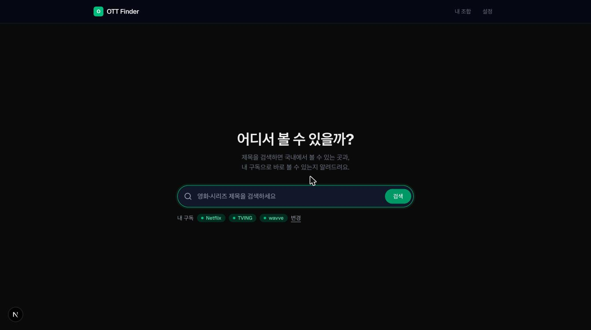
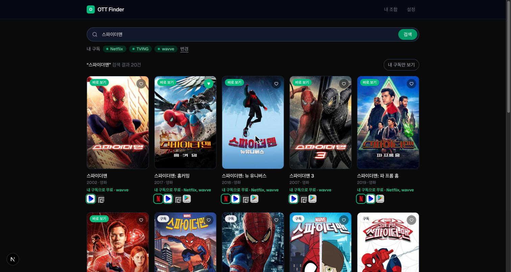
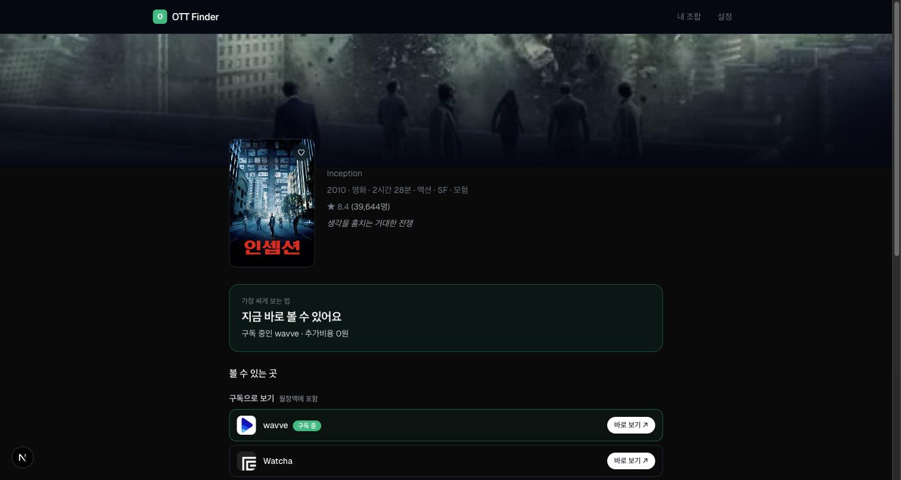
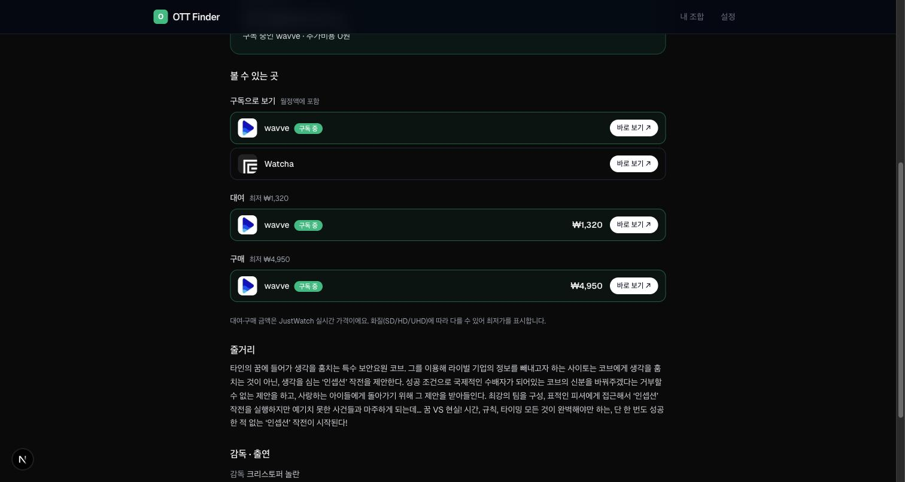
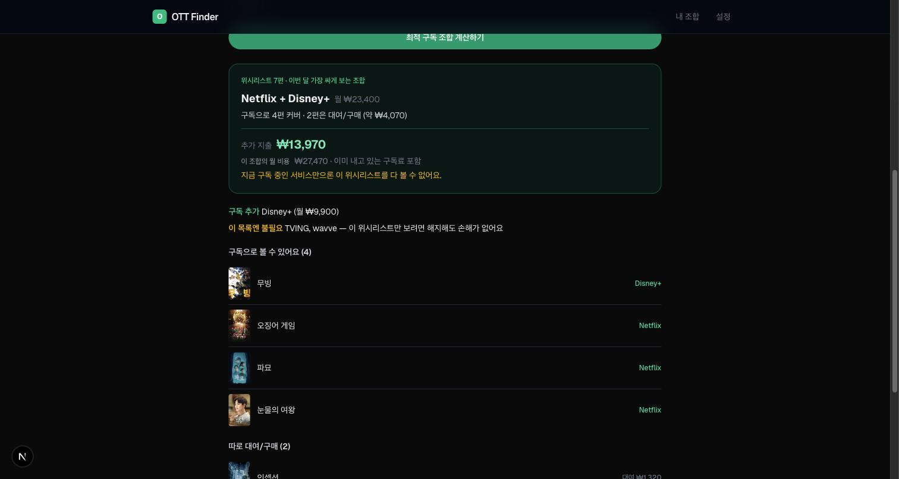
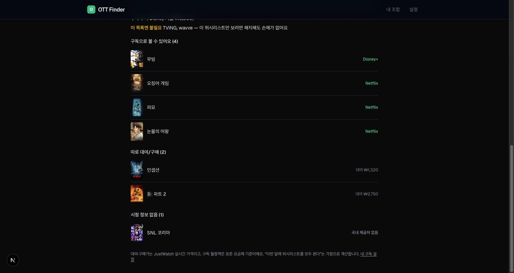
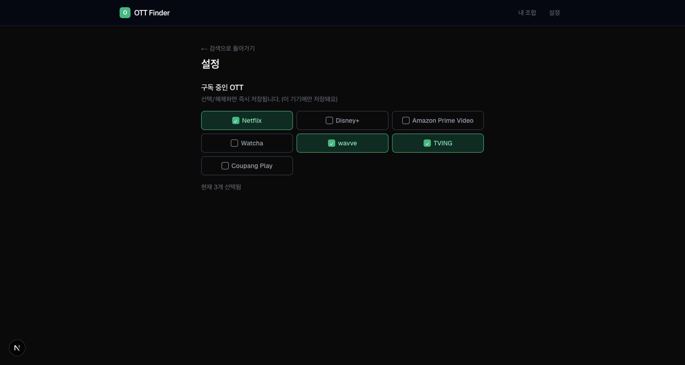
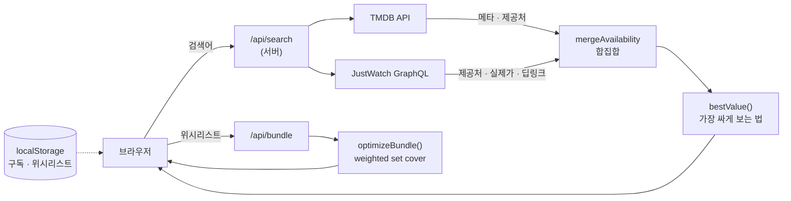

# OTT Finder

> **"이 콘텐츠, 지금 나에게 가장 싸게(또는 공짜로) 보는 방법은 뭐지?"** 에 답하는 서비스.
> JustWatch가 *정보 나열*에서 멈춘다면, OTT Finder는 *결정*까지 대신 내려줍니다.


<p align="center">
  
</p>

---

## 왜 만들었나

기존 서비스(JustWatch, 키노라이츠 등)는 "이 콘텐츠는 넷플릭스/티빙/웨이브에 있어요"까지만 알려주고 **판단은 사용자 몫**으로 남깁니다. 정작 궁금한 건 그다음입니다.

- 내가 **이미 구독 중인** 서비스로 볼 수 있나? → 그럼 추가로 낼 돈은 0원
- 아니라면 대여가 싼가, 구매가 싼가, 아니면 한 달 구독하는 게 나은가?
- 보고 싶은 게 10편 쌓였는데, **어떤 조합**을 구독해야 제일 싼가?

OTT Finder는 검색 도구가 아니라 **의사결정 도구**입니다. 국내(KR) 기준으로 답합니다.

### 비슷한 서비스와 무엇이 다른가

"구독 중인 OTT를 고르면 그 안에서 볼 수 있는 걸 보여준다"는 기능 자체는 이미 표준입니다. [JustWatch](https://www.justwatch.com/kr)의 *My Services* 필터, [키노라이츠](https://m.kinolights.com/)의 구독 기반 추천이 그렇습니다. 여기는 비어 있는 자리가 아닙니다.

다른 건 **그 정보를 무엇에 쓰느냐**입니다.

| | 구독 정보의 용도 |
|---|---|
| 일반적인 OTT 검색 서비스 | **필터** — 내 서비스 것만 보여주거나 강조 |
| OTT Finder | **계산 입력값** — 결론과 금액 자체가 바뀜 |

구체적으로 두 군데에서 갈립니다.

1. **`bestValue()`가 구독 여부를 우선순위 1번에 넣습니다.** 목록에서 거르는 게 아니라 "추가비용 0원"이라는 **결론**이 나옵니다.
2. **`additionalCost`** — 추천 조합의 월비용이 ₩27,470이어도, 이미 넷플릭스를 내고 있다면 **실제로 더 나가는 돈은 ₩13,970**입니다. 이 델타를 메인 숫자로 올립니다.

즉 *"내 구독으로 볼 수 있나"* 가 아니라 **"내 구독을 감안하면 얼마를 더 내야 하나"** 에 답합니다.

---

## 주요 기능

### 1. 검색 — 걸러주는 게 아니라 결론을 냄



포스터 그리드 위에 **상태 배지**(바로 보기 / 구독 / 무료 / 대여·구매)를 얹고, 카드마다 "이 작품을 가장 싸게 보는 법"을 한 줄로 적습니다. `내 구독으로 무료 · wavve`, `대여 ₩1,320` 처럼 **금액까지 결론에 들어갑니다.**

내 구독 서비스는 로고를 강조하고, 결과는 **내 구독 → 구독형 → 무료 → 대여/구매** 순으로 정렬됩니다. `내 구독만 보기` 토글도 있지만, 이건 부가 기능이지 핵심이 아닙니다 — 핵심은 거르지 않아도 **카드만 보고 판단이 끝난다**는 쪽입니다.

### 2. 작품 상세 — 결론 배너 + 실제 가격

<table>
<tr>
<td width="50%"></td>
<td width="50%"></td>
</tr>
</table>

맨 위에 **"가장 싸게 보는 법"** 결론을 배너로 띄우고, 그 아래에 제공처를 구독 / 무료 / 광고형 / 대여 / 구매로 나눠 보여줍니다. 대여·구매 금액은 **JustWatch 실시간 가격**이고, `바로 보기` 버튼은 해당 서비스의 **작품 페이지로 직접** 이동합니다.

> 우선순위: `내 구독(0원)` → `무료` → `광고형 무료` → `대여/구매 중 실제로 싼 쪽` → `구독 필요` → `시청 정보 없음`

### 3. 구독 조합 최적화 — "이 목록을 다 보려면 뭘 구독해야 하나"



보고 싶은 작품을 위시리스트에 담으면, **이번 달에 그걸 다 보는 가장 싼 조합**을 계산합니다.

- **추가 지출**을 메인 숫자로 표시 — 조합 월비용이 ₩27,470이어도 이미 넷플릭스를 내고 있으면 실제로 더 나가는 돈은 ₩13,970입니다
- **구독 추가 / 해지해도 되는 서비스**를 함께 제안
- 구독으로 커버되는 작품, 따로 대여/구매할 작품, 국내 제공처가 없는 작품을 분리해서 나열



알고리즘은 **weighted set cover**입니다. 국내 구독 서비스가 7개뿐이라 모든 부분집합(2ⁿ)을 완전 탐색해 **정확 최적해**를 구합니다(greedy 근사 아님). 목적 함수는 `Σ(선택한 구독 월정액) + Σ(구독으로 안 덮이는 작품의 실제 대여/구매가)`.

### 4. 내 구독 관리



첫 방문 시 온보딩으로 물어보고, 이후 `/settings`에서 언제든 수정합니다. **로그인·DB 없이 localStorage**에만 저장합니다.

---

## 설계에서 중요했던 판단

이 프로젝트에서 가장 많이 고민한 세 가지입니다.

### 추정치를 폐기했다 (v0.4.0)

처음엔 한국 VOD 표준 단가(신작/구작 tier)로 대여가를 **추정**해서 보여줬습니다. 실측해 보니 오차가 컸습니다.

| | 추정치 | 실제 |
|---|---|---|
| 인셉션 대여 | ₩2,500 | **₩1,320** |
| 인셉션 구매 | ₩7,700 | **₩4,950** |

의사결정 도구에서 **틀린 숫자는 숫자가 없는 것보다 나쁩니다.** 그래서 가격 추정 체계(`prices.json`, `estimatePrice()`)를 통째로 삭제하고, 실제 가격을 모르면 **금액 없이 경로만** 알리도록 바꿨습니다("대여 가능"). 조합 계산에서도 가격을 못 구한 작품은 총액에서 빼고 `최소 ₩N +α`로 표시합니다.

### 데이터를 쥐고도 안 쓰고 있었다 (v0.4.1)

사용자 제보로 발견한 버그입니다. 드라마 *동궁*(2026)은 TMDB에 US/JP/GB 등 80개국 Netflix 정보가 있는데 **KR만 통째로 비어** 있었습니다. 그래서 넷플릭스로 볼 수 있는 작품이 "시청 정보 없음"으로 분류되고 조합 계산에서도 빠졌습니다.

원인은 v0.3.0부터 붙여둔 JustWatch를 **가격·딥링크에만 쓰고 "어디서 볼 수 있나"는 TMDB만 믿은 것**이었습니다. 지금은 `mergeAvailability()`가 두 소스를 **합집합**으로 합칩니다. JustWatch의 `packageId`가 TMDB `provider_id`와 같아서(TMDB가 JustWatch에서 provider 데이터를 받아옴) 별도 매핑 테이블 없이 id 기준으로 합쳐집니다.

### 비공식 API에 기대되, 죽어도 앱은 산다

per-title 실제 가격과 딥링크는 `apis.justwatch.com/graphql`에서 옵니다. **문서화되지 않은 비공식 엔드포인트**이고 introspection도 막혀 있습니다. 언제든 깨질 수 있다는 전제로 설계했습니다.

- `lib/justwatch.ts`는 **어떤 실패에서도 예외를 던지지 않고 `null`을 반환**합니다 (5초 타임아웃, 스키마 변경, 차단, 매칭 실패 전부)
- 호출부는 `null`이면 자동으로 강등됩니다 — 금액 없이 "대여 가능", 딥링크 대신 서비스 검색 URL
- **엔드포인트를 실제로 죽여서 검증**했습니다. 추정치가 새어나오는 곳은 없었습니다

매칭도 fuzzy하지 않습니다. JustWatch에 TMDB id 직접 조회 필드가 없어 제목으로 검색하지만, `externalIds.tmdbId` + `objectType`으로 **정확히 대조**합니다. ("오징어 게임" 검색에 딸려오는 *더 챌린지* / *이야기* 같은 것들이 id로 걸러집니다.)

---

## 기술 스택

| 영역 | 선택 |
|---|---|
| 프레임워크 | Next.js 16 (App Router) + React 19 |
| 언어 | TypeScript 5 |
| 스타일 | Tailwind CSS 4 |
| 상태 | `localStorage` + `useSyncExternalStore` (DB·로그인 없음, SSR 안전) |
| 외부 API | TMDB (서버 라우트 프록시, 키 노출 없음) · JustWatch GraphQL |

### 데이터 흐름



TMDB 토큰은 서버 전용 모듈(`server-only`)에만 존재하고, 클라이언트로 나가지 않습니다.

### 프로젝트 구조

```
src/
  app/
    api/search/route.ts             # 통합 검색 프록시 (?q=)
    api/providers/route.ts          # KR 제공처 목록 (ID 검증용)
    api/bundle/route.ts             # 위시리스트 → 최적 구독 조합
    title/[mediaType]/[id]/page.tsx # 작품 상세
    settings/  watchlist/
  lib/
    tmdb.ts          # 서버 전용 TMDB 클라이언트
    justwatch.ts     # 서버 전용 · 딥링크 + 실제가 (실패 시 null)
    availability.ts  # TMDB + JustWatch 제공처 합집합
    pricing.ts       # bestValue() — "가장 싸게 보는 법" 판정
    bundle.ts        # 구독 조합 최적화 (weighted set cover 완전탐색)
    providers.ts     # 국내 OTT 상수 + 광고형 요금제 alias 매핑
    offers.ts  watchLink.ts  image.ts
  hooks/             # useSubscriptions, useWatchlist (localStorage)
  data/
    subscriptions.json  # 구독 월정액 카탈로그 (유일한 수동 seed)
    watch-links.json    # 딥링크 실패 시 쓰는 서비스 검색 URL
```

---

## 로컬에서 실행하기

```bash
git clone https://github.com/haeryung96/ott-finder.git
cd ott-finder
npm install

cp .env.example .env.local
# .env.local 에 TMDB_ACCESS_TOKEN 을 채웁니다 (v4 Read Access Token 권장)

npm run dev
```

http://localhost:3000 을 엽니다.

TMDB 키는 [themoviedb.org/settings/api](https://www.themoviedb.org/settings/api) 에서 무료로 발급받을 수 있습니다. JustWatch는 별도 키가 필요 없습니다.

---

## 데이터 출처와 신뢰도

| 데이터 | 출처 | 성격 |
|---|---|---|
| 작품 메타·검색 | TMDB | 실측 |
| 제공처 (어디서 보나) | TMDB **+** JustWatch 합집합 | 실측 (TMDB KR은 누락이 있음) |
| 대여/구매 **가격** | JustWatch | **실측** (모르면 표시하지 않음) |
| per-title **딥링크** | JustWatch | **실측** (없으면 서비스 검색 URL) |
| 구독 월정액 | `data/subscriptions.json` | 수동 관리 seed |

구독 월정액만 유일하게 실측이 아닙니다 (JustWatch가 구독 요금제 정보를 주지 않음). 각 서비스의 대표 표준 요금제 기준이며, 광고형·프리미엄 요금제나 프로모션에 따라 실제 금액은 다를 수 있습니다.

---

## 알려진 한계 / 다음 할 일

- [ ] **JustWatch 실패를 감지할 방법이 없음** — 지금은 조용히 금액만 사라집니다. 실패율 로깅/알림 필요 (우선순위 높음)
- [ ] **테스트 없음** — `bundle.ts`(set cover), `pricing.ts`는 순수 함수라 vitest 도입 1순위. JustWatch 응답 파싱은 고정 fixture로 스키마 변경을 잡을 수 있음
- [ ] 검색 응답이 항목당 API 2개를 타므로 느려질 수 있음 — 스트리밍/부분 렌더 검토
- [ ] 검색 디바운스·자동완성, 페이지네이션 (현재 20건 고정)
- [ ] 배포 안 됨
- [ ] (확장) 탐색 피드, "이번 달 얼마 아꼈나" 대시보드

### 확인 후 의도적으로 뺀 것

- **시즌별 제공처** — `/tv/{id}/season/{n}/watch/providers`가 200을 주지만 KR 응답이 시리즈 레벨과 `link`까지 동일해서 정보량이 0. 호출만 늘어나 제외
- **Disney+ / Coupang Play 검색 링크** — Disney+는 `/search`가 404, Coupang Play는 SPA catch-all이라 파라미터를 확정할 수 없었음. 추측 대신 TMDB link로 폴백 (`watch-links.json`의 `verified` 플래그에 근거를 남김)

더 자세한 기획·구현 기록은 [PLAN.md](PLAN.md)에 있습니다.

---

## 고지

이 프로젝트는 **개인 학습·포트폴리오 목적**으로 만들었습니다.

- 시청 제공처 데이터는 **JustWatch** 출처입니다 (TMDB의 watch provider 데이터 포함).
- 작품 메타데이터는 **TMDB** API를 사용하지만, 이 제품은 TMDB가 보증하거나 인증한 것이 아닙니다.
  <br>*This product uses the TMDB API but is not endorsed or certified by TMDB.*
- `apis.justwatch.com/graphql`은 비공식 엔드포인트이며, 상업적 이용은 약관 위반입니다.
